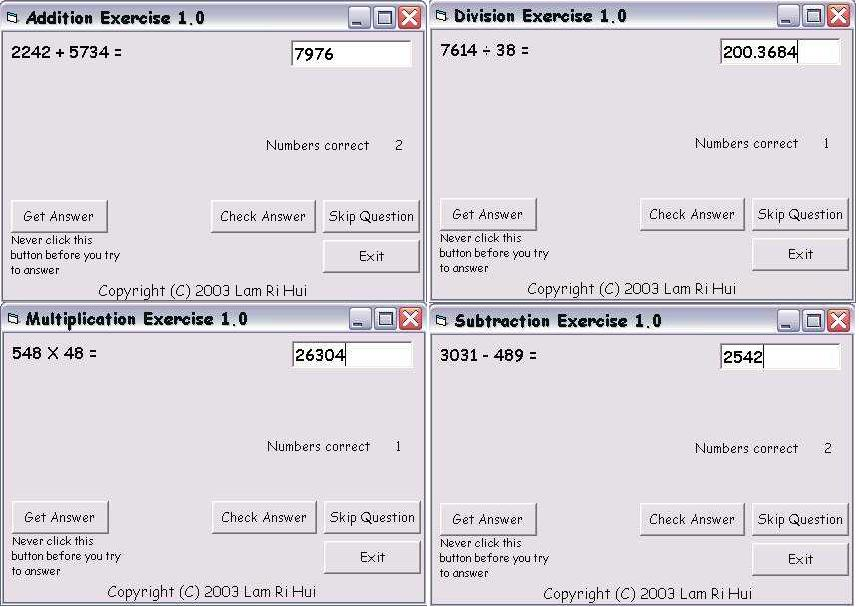



## Exercises 1\.0

### Description

This is a code of multiple exercises. There are addition, subtraction, multiplication and division exercise in 1 zip. The code uses Randomize to generate random numbers and use the generated numbers to make questions. This code can also check your answer see whether it is correct or not. Please vote for my work.
 
### More Info
 

             |
---                |---
**Submitted On**   |2003-09-05 10:57:04
**By**             |[Lam Ri Hui](https://github.com/Planet-Source-Code/PSCIndex/blob/master/ByAuthor/lam-ri-hui.md)
**Level**          |Beginner
**User Rating**    |4.7 (14 globes from 3 users)
**Compatibility**  |VB 4\.0 \(16\-bit\), VB 4\.0 \(32\-bit\), VB 5\.0, VB 6\.0
**Category**       |[Complete Applications](https://github.com/Planet-Source-Code/PSCIndex/blob/master/ByCategory/complete-applications__1-27.md)
**World**          |[Visual Basic](https://github.com/Planet-Source-Code/PSCIndex/blob/master/ByWorld/visual-basic.md)
**Archive File**   |[Exercises\_164148952003\.zip](https://github.com/Planet-Source-Code/lam-ri-hui-exercises-1-0__1-48284/archive/master.zip)

